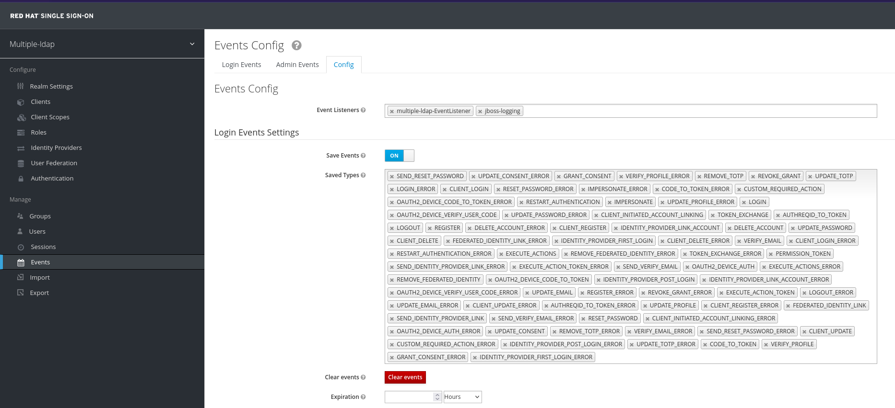
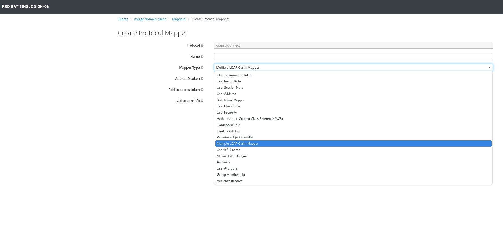

## Custom Event Listener Provider for Keycloak / Red Hat SSO
This extension intercept all user events and manipulate JWT tokens. 
It is built around Keycloak libraries and extensions and can be deployed.


## Requirements
* Java: JDK 11 (must be the same running Keycloak / SSO)
* Apache Maven
* Running instance of Keycloak

## Tested Configurations
* Red Hat SSO 7.6.* Single Node
* Red Hat SSO 7.6.* HA Cluster
* Java 11

## Build
Java: JDK 11 (must be the same running Keycloak / SSO)
Packaging: Maven

```shell
$ ./mvnw clean package
```
This generates target/sso-event-listener-provider.jar**

# Deploy Single Node

* Deploy **target/keycloak-crm-event-listener-provider.jar** to {KEYCLOAK_HOME}/standalone/deployments

# Deploy Cluster

* Deploy **target/keycloak-crm-event-listener-provider.jar** to {KEYCLOAK_HOME}/standalone/deployments on all cluster nodes

# How to activate Event Listener
1. Access to Selected realm (/auth/admin/{REALM}/console). User privileges must allow event management
2. Click on "Events" link on left menu (see image)
3. Click on "Event Listener" field, a dropdown will appear and will see 'multiple-ldap-EventListener'
4. By Clicking on that Event listener will be added to the combo.
5. Click Save.


# How to configure Protocol mapper
1. Access to the client in realm client's list
2. Click on "Mappers"
3. Click on the "Create" button
4. Select "Multiple LDAP Claim Mapper" as "Mapper Type"
5. Define a name for the mapper and select the checkboxes accordingly
6. Click Save.


# Make it operate
1. Tail server.log on your server (all nodes if running a cluster, you don't know which node will be involved in user events, it depends on load balancer).
2. If you already have a Client Id up&Running, try to do some user activities (login/logout/register).
3. For testing purpose only, this module can be activated in "Master" realm and can be used with "account" application, by "Impersonatig" user.

### Effects
In log tail you shuld be able to see messages like this one


## Test with actual LDAP server

In order to configure two OpenLDAP server you could follow the guide in [this readme](docs/README.md) .


